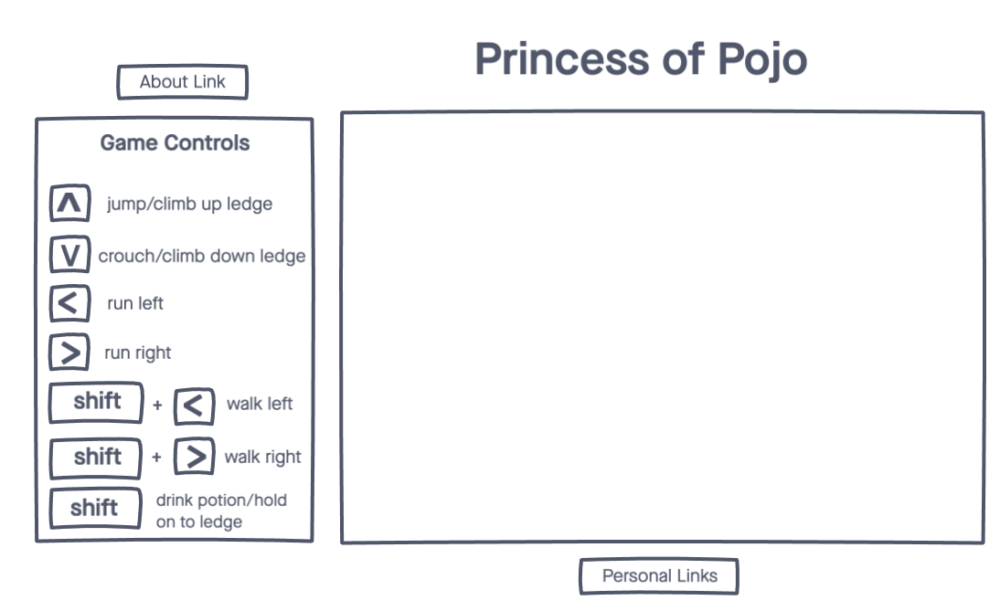

# Princess of Pojo

<!-- [Live Demo]() -->

## Background

The 1989 Prince of Persia is a cult classic platformer computer game. In the game, the main character has 60 minutes to escape a dungeon, get to the palace tower, defeat Jaffar, and rescue the Princess. Not only does he face guards, but also has to avoid various traps like breakaway tiles and spike pits.

## Functionality & MVP

With this Prince of Persia variation, users will be able to:
* Have basic movement such as: run, jump, climb, crouch, walk
* Battle enemies (sword fights)
* Increase health by drinking potions
* Navigate through at least one level avoiding various and sundry traps (spike pits, breakaway tiles, chompers)
In addition, this project will include:
* An about page describing the background and rules of the game
* A production README

## Wireframes

AThis app will consists of a single screen with the game window, game control legend, and nav links to my Github, my LinkedIn, and the About Page.

 ## Architecture and Technologies

This project will be implemented with the following technologies:
* JavaScript for game logic
* Canvas for effects and animation

 ## Implementation Timeline

### Day 1:
* Set up project skeleton and create a basic template for my page
### Day 2:
* Begin work on movement logic and sprite animation
### Day 3:
* Continue work on movement logic and sprite animation
### Day 4:
* Build out dungeon level with traps
