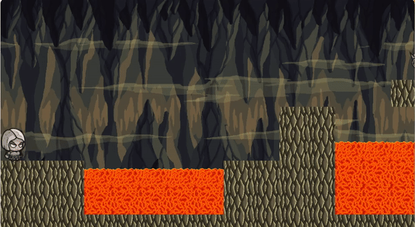
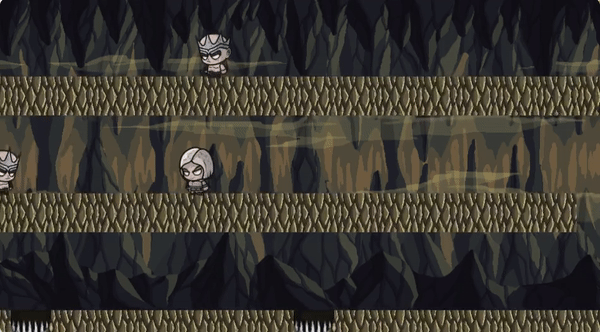
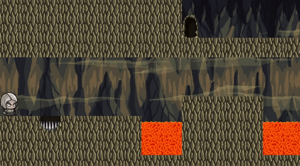

# Princess of Pojo

[Live Link](https://ladymicaela.github.io/princess-of-pojo/dist/index.html)

## Background

The 1989 Prince of Persia is a cult classic platformer computer game. In the game, the main character has 60 minutes to escape a dungeon, get to the palace tower, defeat Jaffar, and rescue the Princess. Not only does he face guards, but also has to avoid various traps like breakaway tiles and spike pits.

In Princess of Pojo, I attempted to recreate this classic platformer, but with a slight gender twist.

## Technologies

This project was implemented with the following technologies:
* JavaScript for game logic
* Canvas for effects and animations

## Functionality & MVPs

*With this Prince of Persia variation, users are able to:*

### Have basic movement such as: run left / right, jump



*Key events are tracked in order to determine the players movement.*

```javascript
function trackKeys(keys) {
    let down = Object.create(null);
    function track(event) {
        if (keys.includes(event.key)) {
            down[event.key] = event.type == "keydown";
        }
    }
    window.addEventListener("keydown", track);
    window.addEventListener("keyup", track);
    return down;
}

const keys =
    trackKeys(["a", "d", "w", "Shift"]);
```

### Battle enemies (sword fights)



*If the shift key is pressed, the player will have her sword drawn.*

```javascript
 if (player.slashing) {
        spriteImg = slashingSprites;
    } else {
        spriteImg = playerSprites;
    }
```

*And if her sword is drawn when she encounters an enemy, the enemy will be removed. Otherwise, the level is lost.*

```javascript
Enemy.prototype.collide = function(state) {
    let filtered = state.actors.filter(a => a != this);
    let player = state.actors.filter(a => a.type == "player").shift();
    let status = state.status;
    if (player.slashing) {
        return new State(state.level, filtered, status);
    } else { 
        return new State(state.level, state.actors, "lost");
    }
}
```

### Navigate through levels avoiding various traps (lava, spike pits, etc.)



*If the player touches the lava or falls into the spike pits, the level is lost.*

```javascript
if (this.level.touches(player.pos, player.size, "lavaTop")) {
        return new State(this.level, actors, "lost");
    }

    if (this.level.touches(player.pos, player.size, "trap")) {
        return new State(this.level, actors, "lost");
    }
```